# 4. PROJETO DO DESIGN DE INTERAÇÃO

## 4.1 Personas

### Persona 1 — Lucas Ferreira

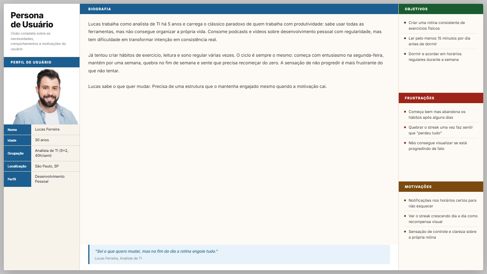

### Persona 2 — Ricardo Oliveira

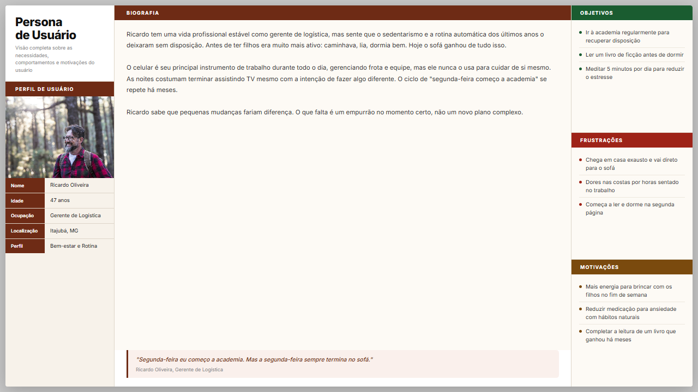

### Persona 3 — Roberto Alves

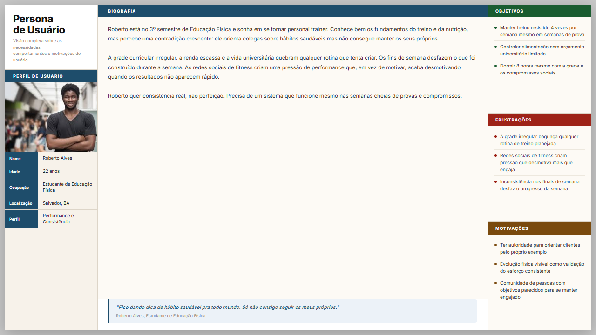

### Persona 4 — Fernanda Lima

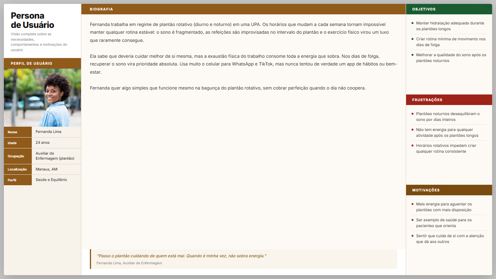

### Persona 5 — Camila Torres

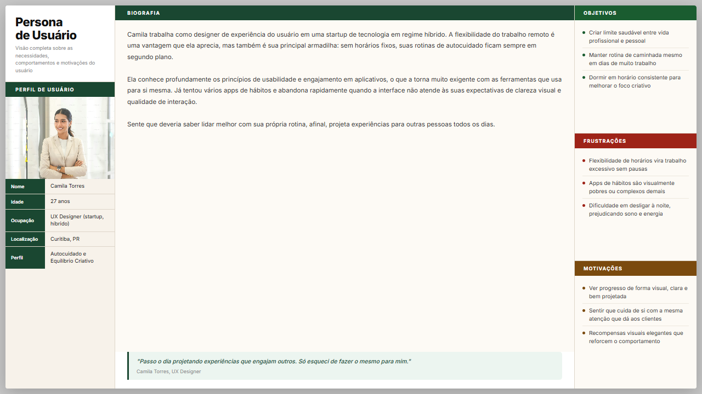

### Persona 6 — Ana Souza

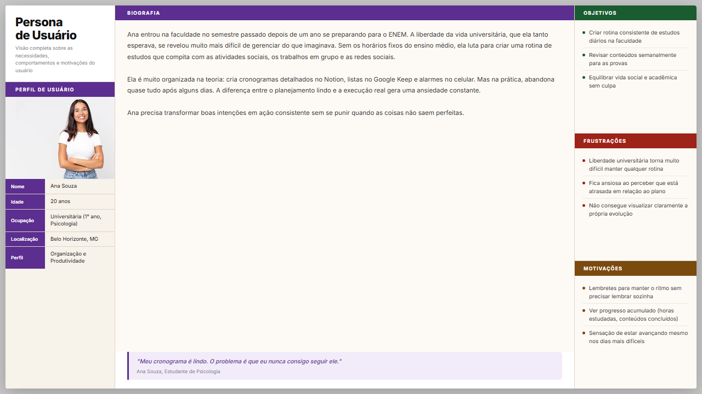

## 4.2 Mapa de Empatia

### Mapa de Empatia — Lucas Ferreira

### Mapa de Empatia — Ricardo Oliveira

### Mapa de Empatia - Roberto Alves

### Mapa de Empatia - Fernando Lima

### Mapa de Empatia - Camila Torres

### Mapa de Empatia - Ana Souza

## 4.3 Protótipos das Interfaces

O protótipo de alta fidelidade do Sistema de Acompanhamento de Hábitos (SAH) foi desenvolvido como uma aplicação interativa responsiva, contemplando versões para desktop (1280×820 px) e mobile (360×760 px, moldura estilo iPhone). O protótipo está disponível no arquivo `SAH Prototype _standalone_.html` e é totalmente navegável no navegador, sem dependência de servidor externo.

O protótipo está organizado em três seções, totalizando 13 artboards, detalhados individualmente a seguir.

### Identidade Visual

O protótipo adota uma paleta de cores quentes e escuras (fundo `#1a1715`, superfícies `#2a2622`) combinada com verde como cor primária e roxo como cor de destaque. A cor de *streak* (sequência de dias) é diferenciada para reforçar o elemento de engajamento central do sistema. O protótipo oferece um painel de ajustes (*TweaksPanel*) que permite customizar cores, densidade de layout (compacto/regular/confortável), raio dos cards e estilo de ilustração (blobs/dots/minimal), demonstrando a flexibilidade do sistema de design.

---

### Seção 1 — Módulo de Autenticação

#### Artboard 01 — Login (desktop)

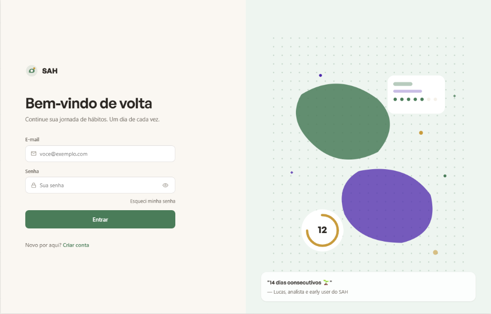

**1. Objetivo da tela**
Permitir que o usuário acesse o sistema informando suas credenciais (e-mail e senha), com opções de persistência de sessão ("Lembrar-me") e navegação para recuperação de senha. Exibe mensagem motivacional para engajar o usuário desde o primeiro acesso.

**2. Princípios Gestálticos**
- **Proximidade:** Os campos de e-mail e senha, o checkbox "Lembrar-me" e o botão de login estão agrupados em um card central, indicando que formam uma unidade funcional coesa.
- **Figura e fundo:** O card de login contrasta com o fundo escuro (`#1a1715`), delimitando claramente a área de interação sem o uso de bordas pesadas.
- **Pregnância:** O botão de ação principal ("Entrar") utiliza a cor primária e forma simples (retângulo arredondado), tornando a ação principal imediatamente reconhecível.

**3. Recomendações Ergonômicas**
- **Compatibilidade:** A disposição sequencial dos campos (e-mail → senha → ação) segue o modelo mental do usuário e o fluxo natural de leitura (top-down).
- **Condução:** Rótulos posicionados acima dos campos orientam o preenchimento, reduzindo ambiguidade sobre o que deve ser inserido em cada input.
- **Gestão de erros:** Mensagens de erro são exibidas inline, próximas ao campo com falha, facilitando a identificação e correção sem perda de contexto.
- **Brevidade:** O formulário é minimalista — apenas os campos estritamente necessários para autenticação estão presentes, reduzindo a carga cognitiva.

**4. Regras de Ouro (Shneiderman)**
- **Consistência:** O layout, a tipografia e as cores seguem o sistema de design utilizado em todas as demais telas.
- **Feedback informativo:** Erros de autenticação (credenciais inválidas) geram mensagem imediata e específica abaixo do formulário.
- **Prevenção e tratamento simples de erros:** O campo de senha permite revelar o texto digitado (ícone de olho), prevenindo erros de digitação.
- **Redução da carga de memória de curto prazo:** A opção "Lembrar-me" dispensa o usuário de reinserir as credenciais a cada sessão.

---

#### Artboard 02 — Cadastro (desktop)

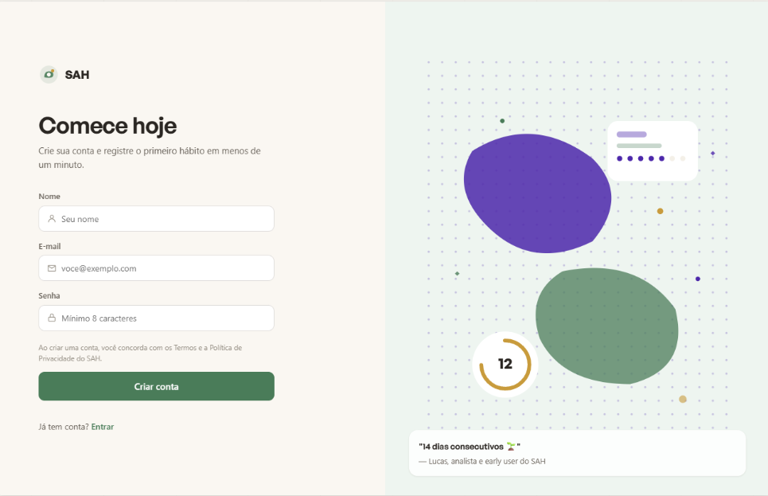

**1. Objetivo da tela**
Permitir que novos usuários criem uma conta no sistema informando nome, e-mail e senha.

**2. Princípios Gestálticos**
- **Proximidade:** Os campos do formulário são agrupados em um card único, separando visualmente o bloco de cadastro do restante da página.
- **Semelhança:** Os campos de entrada compartilham o mesmo estilo visual (bordas, tipografia, espaçamento), sinalizando que pertencem ao mesmo formulário.
- **Pregnância:** A sequência nome → e-mail → senha segue uma ordem lógica simples e esperada pelo usuário.

**3. Recomendações Ergonômicas**
- **Condução:** Rótulos descritivos e placeholders orientam o formato esperado de cada campo (ex.: nome completo, e-mail válido).
- **Controle do usuário:** Link visível para retornar à tela de login permite que o usuário navegue sem depender do botão "voltar" do navegador.
- **Gestão de erros:** Validação em tempo real (ex.: e-mail com formato inválido, senha fraca) fornece orientação antes do envio do formulário.
- **Brevidade:** O formulário contém apenas os campos essenciais para criação de conta, sem coleta antecipada de dados opcionais.

**4. Regras de Ouro (Shneiderman)**
- **Consistência:** Mesma estrutura visual e comportamento dos campos em relação à tela de login.
- **Conclusão de diálogos:** Após o cadastro bem-sucedido, o usuário recebe confirmação explícita e é direcionado ao próximo passo.
- **Prevenção e tratamento simples de erros:** Indicador de força da senha orienta o usuário a criar credenciais mais seguras antes do envio.
- **Feedback informativo:** Erros de validação (e-mail já cadastrado, senha fora do padrão) são exibidos de forma clara e específica.

---

#### Artboard 03 — Recuperar senha (desktop)

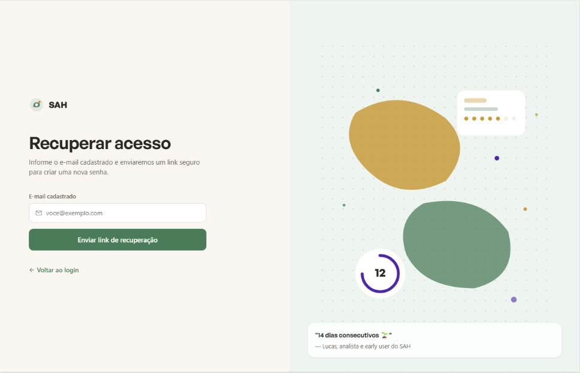

**1. Objetivo da tela**
Permitir que o usuário solicite o envio de um link de redefinição de senha para o e-mail cadastrado.

**2. Princípios Gestálticos**
- **Pregnância (boa forma):** A tela apresenta apenas um campo (e-mail) e um botão de ação, eliminando qualquer distração e focando o usuário na única tarefa disponível.
- **Figura e fundo:** O card de recuperação destaca-se do fundo escuro, mantendo a consistência visual com as demais telas de autenticação.

**3. Recomendações Ergonômicas**
- **Brevidade:** Interface reduzida ao mínimo necessário — um campo e um botão — minimiza o esforço cognitivo e operacional do usuário em um momento de frustração (esquecimento de senha).
- **Condução:** Texto instrucional acima do campo explica claramente o que acontecerá após o envio.
- **Controle do usuário:** Link para retornar ao login permite que o usuário abandone o fluxo sem consequências caso se recorde da senha.

**4. Regras de Ouro (Shneiderman)**
- **Feedback informativo:** A submissão do formulário leva à tela de confirmação (Artboard 05), comunicando que o e-mail foi enviado com sucesso.
- **Conclusão de diálogos:** A tela de "link enviado" encerra explicitamente o fluxo de recuperação, sem deixar o usuário em estado de dúvida.
- **Prevenção e tratamento simples de erros:** Campo de e-mail com validação de formato impede envios com endereços inválidos.

---

#### Artboard 04 — Login (mobile)

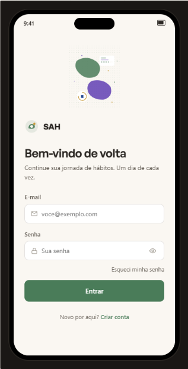

**1. Objetivo da tela**
Versão adaptada da tela de login para dispositivos móveis, mantendo todas as funcionalidades da versão desktop dentro de uma moldura de smartphone (360×760 px).

**2. Princípios Gestálticos**
- **Proximidade:** O agrupamento dos elementos no card central é preservado, adaptado à largura reduzida do viewport.
- **Continuidade:** A disposição vertical dos elementos (logotipo → campos → botão) segue o padrão de rolagem natural em dispositivos móveis.

**3. Recomendações Ergonômicas**
- **Compatibilidade com o dispositivo:** Alvos de toque (botões e campos) respeitam a dimensão mínima recomendada de 44×44 px, reduzindo erros de toque.
- **Acessibilidade:** Fonte em tamanho mínimo de 16 px, evitando que o campo de texto acione zoom automático em iOS.
- **Condução:** Teclado virtual do tipo e-mail é ativado automaticamente no campo de e-mail, reduzindo erros de digitação.
- **Brevidade:** O layout compacto elimina elementos decorativos presentes na versão desktop que não agregam valor na tela móvel.

**4. Regras de Ouro (Shneiderman)**
- **Consistência:** Mesma lógica de interação e feedback da versão desktop, garantindo que usuários que alternem entre dispositivos não precisem reaprender a interface.
- **Atalhos para usuários frequentes:** Suporte ao preenchimento automático de credenciais pelo gerenciador de senhas do dispositivo.
- **Redução da carga de memória de curto prazo:** Estrutura idêntica à versão desktop facilita a orientação do usuário que já conhece o sistema.

---

#### Artboard 05 — Estado: link enviado

**1. Objetivo da tela**
Confirmar ao usuário que o e-mail de redefinição de senha foi enviado com sucesso e orientar sobre os próximos passos.

**2. Princípios Gestálticos**
- **Pregnância:** Ícone de envelope centralizado e de tamanho proeminente comunica instantaneamente o resultado da ação (e-mail enviado).
- **Figura e fundo:** Área de confirmação destacada sobre o fundo, mantendo o foco do usuário na mensagem de sucesso.

**3. Recomendações Ergonômicas**
- **Condução:** Texto instrucional claro orienta o usuário sobre o que fazer a seguir ("Acesse sua caixa de entrada e clique no link recebido").
- **Gestão de erros:** Botão para reenviar o e-mail caso o usuário não o tenha recebido, prevenindo travamento no fluxo.
- **Brevidade:** A tela não exige nenhuma ação obrigatória — o usuário pode sair e consultar o e-mail, ou retornar ao login diretamente.

**4. Regras de Ouro (Shneiderman)**
- **Conclusão de diálogos:** Esta tela encerra explicitamente o fluxo de recuperação de senha, eliminando ambiguidade sobre se a ação foi concluída.
- **Feedback informativo:** Confirmação visual e textual clara do envio do e-mail, sem termos técnicos.
- **Reversão fácil de ações:** Botão "Voltar ao login" permite que o usuário retorne imediatamente caso se lembre da senha.

---

### Seção 2 — Painel Administrativo

#### Artboard 06 — Dashboard Admin (desktop)

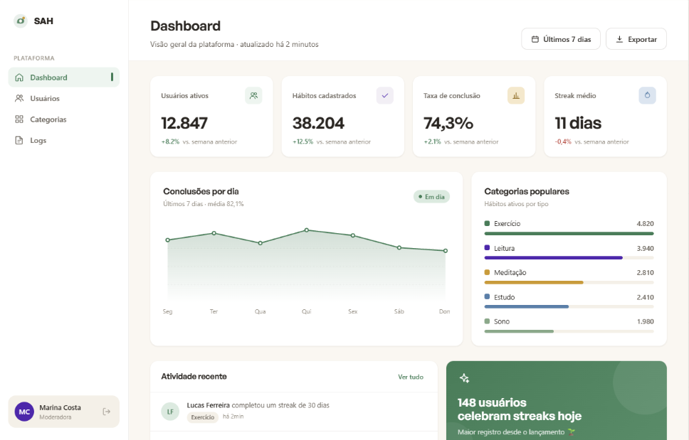

**1. Objetivo da tela**
Apresentar uma visão geral da plataforma ao administrador, com indicadores de uso, atividade recente e acesso rápido às seções principais do sistema.

**2. Princípios Gestálticos**
- **Proximidade:** Indicadores agrupados em cards temáticos (usuários ativos, hábitos cadastrados, logs recentes) sinalizam que os dados pertencem ao mesmo domínio.
- **Semelhança:** Todos os cards de métricas seguem o mesmo padrão visual (ícone + número + rótulo), criando consistência na leitura dos dados.
- **Continuidade:** A barra de navegação lateral guia o olhar verticalmente de cima para baixo, seguindo a hierarquia das seções do sistema.
- **Figura e fundo:** As superfícies dos cards (`#2a2622`) se destacam sobre o fundo escuro (`#1a1715`), delimitando claramente cada bloco de informação sem bordas pesadas.

**3. Recomendações Ergonômicas**
- **Condução:** Menu lateral com ícones e rótulos textuais orienta o administrador pelas seções disponíveis sem necessidade de exploração.
- **Adaptabilidade:** Densidade de layout configurável (compacto/regular/confortável) permite que o administrador ajuste a interface à sua preferência.
- **Compatibilidade:** Organização das informações em ordem de importância (métricas principais no topo, detalhes abaixo) alinha-se ao fluxo de trabalho do administrador.
- **Carga de trabalho:** Acesso direto às seções mais frequentes (usuários, categorias) via atalhos no dashboard reduz o número de cliques necessários.

**4. Regras de Ouro (Shneiderman)**
- **Consistência:** Navegação lateral presente em todas as telas do painel, com item ativo destacado visualmente.
- **Atalhos para usuários frequentes:** Dashboard exibe as informações mais relevantes na tela inicial, sem necessidade de navegação adicional para consultas rotineiras.
- **Controle e iniciativa do usuário:** Painel de ajustes (*Tweaks*) permite personalizar cores, densidade e estilo visual conforme a preferência do administrador.
- **Redução da carga de memória de curto prazo:** Ícones acompanhados de rótulos textuais no menu eliminam a necessidade de memorizar o significado de cada símbolo.

---

#### Artboard 07 — Dashboard Admin (mobile)

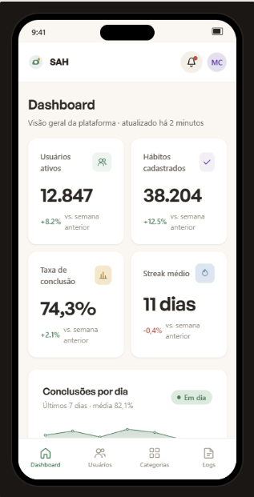

**1. Objetivo da tela**
Versão do dashboard administrativo adaptada para smartphone, mantendo as informações essenciais em uma estrutura adequada ao uso móvel.

**2. Princípios Gestálticos**
- **Continuidade:** A reorganização dos cards em coluna única preserva a hierarquia visual da versão desktop, adaptada ao scroll vertical.
- **Proximidade:** Indicadores de métricas agrupados sequencialmente, mantendo a coesão informacional da versão desktop.

**3. Recomendações Ergonômicas**
- **Compatibilidade com o dispositivo:** Navegação adaptada para toque (menu hambúrguer ou barra de navegação inferior), substituindo o menu lateral fixo da versão desktop.
- **Alvos de toque:** Botões e links com dimensões adequadas ao uso por toque (mínimo 44×44 px).
- **Brevidade:** Informações menos críticas são omitidas ou acessíveis por expansão, priorizando as métricas mais relevantes na tela inicial.
- **Carga de trabalho:** Ações de gestão rápida (acessar logs, ver usuários) disponíveis diretamente nos cards sem necessidade de percorrer o menu.

**4. Regras de Ouro (Shneiderman)**
- **Consistência:** Mesma hierarquia de informações da versão desktop, garantindo continuidade ao usuário que alterna entre dispositivos.
- **Redução da carga de memória de curto prazo:** Rótulos mantidos mesmo na versão compacta, evitando ícones sem texto em contextos críticos de administração.
- **Feedback informativo:** Estados de carregamento e erro utilizados de forma idêntica à versão desktop.

---

#### Artboard 08 — Gerenciamento de Usuários

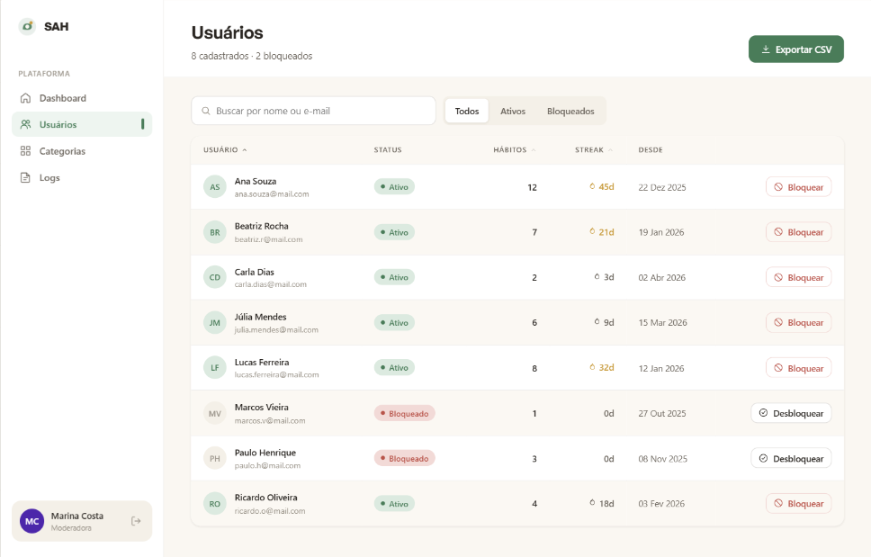

**1. Objetivo da tela**
Permitir ao administrador visualizar, pesquisar e gerenciar os usuários da plataforma, incluindo controles de nível de acesso e bloqueio de contas.

**2. Princípios Gestálticos**
- **Semelhança:** Cada linha da listagem segue o mesmo padrão (avatar + nome + e-mail + status + ações), criando uma grade previsível de leitura.
- **Proximidade:** Botões de ação (editar, bloquear) posicionados junto ao registro do usuário correspondente, evitando ambiguidade sobre a qual item a ação se aplica.
- **Continuidade:** A listagem em formato de tabela guia o olhar horizontalmente ao longo de cada linha, facilitando a varredura de informações.

**3. Recomendações Ergonômicas**
- **Condução:** Barra de pesquisa posicionada no topo da listagem facilita a localização de usuários específicos sem percorrer a lista manualmente.
- **Gestão de erros:** Ações destrutivas (bloqueio de conta) requerem confirmação em modal antes de serem executadas, evitando ações acidentais.
- **Compatibilidade:** Indicadores de status (ativo/bloqueado) utilizam cores e ícones convencionais (verde/vermelho), alinhando-se ao modelo mental do usuário.
- **Adaptabilidade:** Filtros por status e nível de acesso permitem que o administrador segmente a listagem conforme sua necessidade.

**4. Regras de Ouro (Shneiderman)**
- **Consistência:** Padrão de tabela com ações contextuais mantido em todas as listagens do painel administrativo.
- **Reversão fácil de ações:** Modal de confirmação antes do bloqueio permite cancelar a ação; desbloqueio disponível após a confirmação.
- **Prevenção e tratamento simples de erros:** Confirmação obrigatória antes de ações destrutivas, com descrição clara da consequência da ação.
- **Feedback informativo:** Notificação imediata após bloqueio ou alteração de nível de acesso confirma que a ação foi executada com sucesso.

---

#### Artboard 09 — Categorias de Hábitos

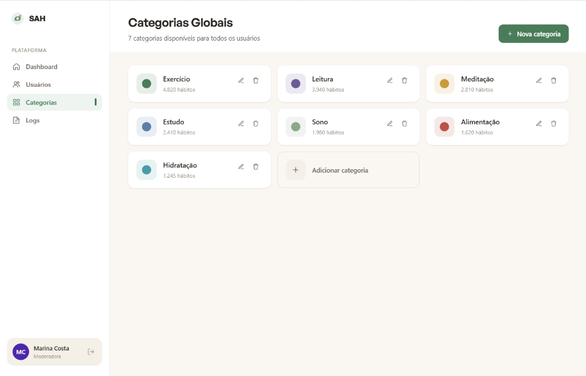

**1. Objetivo da tela**
Permitir ao administrador criar, editar e excluir as categorias de hábitos disponíveis na plataforma para os usuários finais.

**2. Princípios Gestálticos**
- **Semelhança:** Cada card de categoria segue o mesmo layout (ícone + nome + contagem de hábitos vinculados + ações), estabelecendo uma grade visual uniforme.
- **Proximidade:** Botões de edição e exclusão agrupados junto ao card da categoria correspondente, eliminando ambiguidade sobre a qual item a ação se aplica.
- **Pregnância:** Uso de formas simples (ícones representativos e pílulas coloridas) para identificação rápida de cada categoria.

**3. Recomendações Ergonômicas**
- **Condução:** Botão de adição de nova categoria posicionado em local de destaque (topo direito), seguindo a convenção de interfaces administrativas.
- **Gestão de erros:** Exclusão de categoria com hábitos vinculados exibe aviso informando o impacto da ação antes de prosseguir.
- **Brevidade:** Formulário de criação/edição de categoria minimalista (nome, ícone, cor), evitando campos desnecessários.
- **Compatibilidade:** Ícones de categoria utilizados na interface do usuário final são pré-visualizados no painel de administração, permitindo que o administrador avalie a aparência antes de publicar.

**4. Regras de Ouro (Shneiderman)**
- **Consistência:** Padrão visual de cards igual ao utilizado no dashboard e nas demais listagens do painel.
- **Reversão fácil de ações:** Exclusão de categoria requer confirmação e informa quantos hábitos serão afetados.
- **Prevenção e tratamento simples de erros:** Validação do formulário impede a criação de categorias duplicadas ou sem nome.
- **Controle e iniciativa do usuário:** Administrador define ícone e cor da categoria, personalizando a experiência do usuário final.

---

#### Artboard 10 — Logs de Atividade

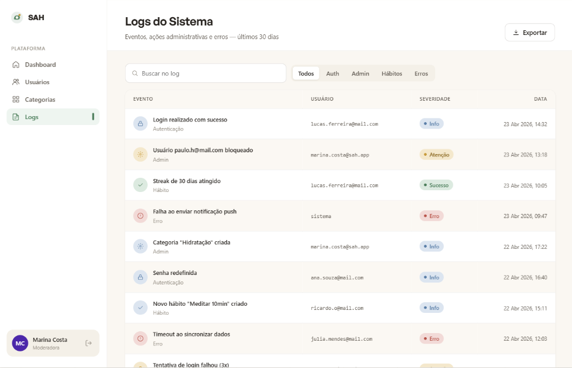

**1. Objetivo da tela**
Apresentar o histórico de ações realizadas no sistema em um painel de auditoria, com registros filtráveis por tipo de evento, usuário e período.

**2. Princípios Gestálticos**
- **Semelhança:** Cada entrada de log segue o mesmo formato (timestamp + ícone de tipo + descrição + usuário), facilitando a varredura vertical da listagem.
- **Continuidade:** Listagem cronológica em ordem decrescente (mais recentes no topo) segue o modelo mental de um registro de eventos.
- **Proximidade:** Filtros agrupados em uma barra de controle acima da listagem, separados visualmente do conteúdo dos logs.

**3. Recomendações Ergonômicas**
- **Condução:** Filtros por tipo de evento (login, cadastro, bloqueio, erro) posicionados de forma proeminente, orientando o administrador na busca por eventos específicos.
- **Adaptabilidade:** Combinação de filtros por tipo, usuário e período permite segmentações específicas conforme a necessidade de auditoria.
- **Compatibilidade:** Formato de timestamp legível (data e hora local) sem necessidade de converter formatos técnicos.
- **Gestão de erros:** Estado de "nenhum resultado" exibido quando nenhum log corresponde aos filtros aplicados, com opção de limpar filtros rapidamente.

**4. Regras de Ouro (Shneiderman)**
- **Consistência:** Padrão de tabela/lista com filtros no topo igual ao utilizado no gerenciamento de usuários.
- **Atalhos para usuários frequentes:** Filtro rápido por tipo de evento mais recorrente (ex.: "Erros") reduz o tempo de investigação em rotinas de auditoria.
- **Controle e iniciativa do usuário:** Combinação livre de filtros permite que o administrador construa consultas de auditoria personalizadas.
- **Redução da carga de memória de curto prazo:** Filtros aplicados permanecem visíveis como chips removíveis, sem necessidade de reconfigurar toda a busca ao ajustar um critério.

---

### Seção 3 — Estados do Sistema

#### Artboard 11 — Carregando

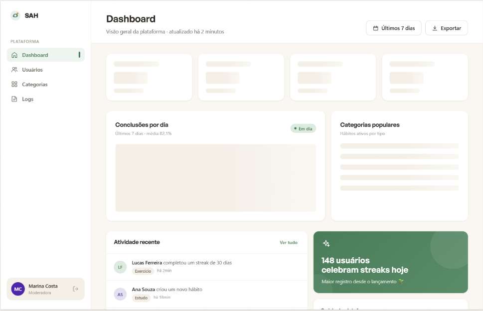

**1. Objetivo da tela**
Comunicar ao usuário que o sistema está processando uma requisição, evitando a percepção de travamento ou inatividade durante operações assíncronas.

**2. Princípios Gestálticos**
- **Pregnância:** Indicador de carregamento animado (spinner ou skeleton screen) em forma circular, reconhecível universalmente como símbolo de processamento.
- **Figura e fundo:** O indicador é posicionado no centro da área de conteúdo, destacando-se do fundo sem competir com outros elementos.

**3. Recomendações Ergonômicas**
- **Condução:** Mensagem textual contextual abaixo do indicador informa o que está sendo carregado (ex.: "Carregando seus hábitos…"), reduzindo a ansiedade de espera.
- **Gestão de erros:** Caso o carregamento exceda um tempo limite, o estado de erro (Artboard 13) é exibido automaticamente com opção de nova tentativa.
- **Compatibilidade:** Uso de *skeleton screens* (placeholders de conteúdo) como alternativa ao spinner, preservando o layout esperado e reduzindo a percepção subjetiva do tempo de espera.

**4. Regras de Ouro (Shneiderman)**
- **Feedback informativo:** O estado de carregamento é exibido imediatamente após qualquer ação que gere processamento, confirmando que o sistema recebeu a solicitação do usuário.
- **Consistência:** Mesmo padrão de indicador de carregamento utilizado em todas as telas que requerem processamento assíncrono.
- **Prevenção e tratamento simples de erros:** Botões e inputs são desabilitados durante o carregamento, prevenindo duplicação de requisições por cliques acidentais.

---

#### Artboard 12 — Nenhum resultado

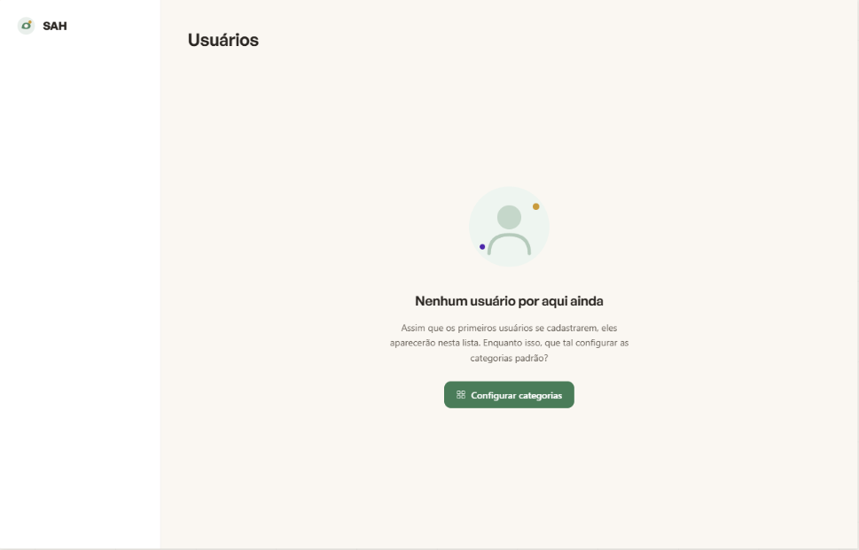

**1. Objetivo da tela**
Comunicar ao usuário que a área acessada está vazia (sem dados cadastrados ou sem resultados para os filtros aplicados), com orientação clara sobre o próximo passo.

**2. Princípios Gestálticos**
- **Pregnância:** Ilustração simples e centralizada (ícone ou imagem vetorial) comunica visualmente o estado vazio de forma amigável, sem gerar sensação de erro.
- **Figura e fundo:** A ilustração e o texto são posicionados no centro da área de conteúdo, garantindo destaque mesmo em uma tela sem dados.

**3. Recomendações Ergonômicas**
- **Condução:** Chamada à ação contextual (ex.: "Adicionar primeiro hábito", "Configurar categorias") orienta o usuário sobre como sair do estado vazio, evitando desorientação.
- **Gestão de erros:** Diferenciação visual e textual entre "lista vazia porque não há dados" e "lista vazia porque os filtros não retornaram resultados", com opção de limpar filtros no segundo caso.
- **Compatibilidade:** A mensagem exibida varia conforme o contexto (seção de hábitos, categorias, logs), tornando o estado vazio relevante e acionável para cada situação.

**4. Regras de Ouro (Shneiderman)**
- **Feedback informativo:** Mensagem clara que explica o motivo da ausência de dados, sem deixar o usuário sem orientação sobre o que fazer.
- **Controle e iniciativa do usuário:** Botão de ação primária posicionado abaixo da ilustração permite ao usuário agir diretamente a partir do estado vazio.
- **Consistência:** Padrão visual de estado vazio (ilustração + texto explicativo + chamada à ação) mantido em todas as seções da aplicação.

---

#### Artboard 13 — Erro global

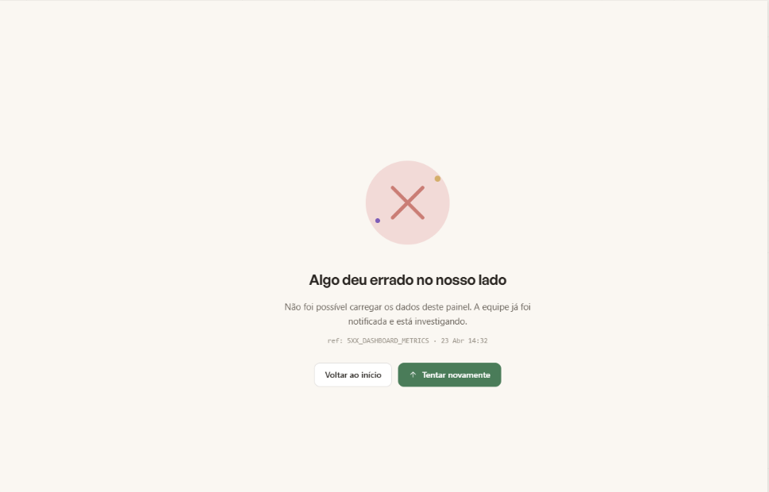

**1. Objetivo da tela**
Comunicar ao usuário que ocorreu um erro inesperado no sistema, de forma humanizada e não técnica, indicando que a equipe foi notificada e oferecendo caminhos claros de recuperação.

**2. Princípios Gestálticos**
- **Pregnância:** Ilustração de erro centralizada (ícone de alerta ou imagem representativa) comunica o estado de falha de forma visual e imediata, sem expor mensagens técnicas.
- **Figura e fundo:** Área de mensagem de erro destacada sobre o fundo, mantendo o foco do usuário nas opções de recuperação disponíveis.

**3. Recomendações Ergonômicas**
- **Gestão de erros:** Mensagem em linguagem natural, sem jargões técnicos ou códigos de erro expostos diretamente ao usuário final.
- **Condução:** Duas opções de recuperação claras ("Tentar novamente", "Ir ao início") permitem que o usuário escolha a ação mais adequada ao seu contexto.
- **Compatibilidade:** Informação de que a equipe foi automaticamente notificada reduz a frustração do usuário e elimina a necessidade de reportar o problema manualmente.
- **Brevidade:** A tela não exige nenhuma ação obrigatória além de escolher como prosseguir, minimizando o esforço em um momento adverso.

**4. Regras de Ouro (Shneiderman)**
- **Feedback informativo:** O usuário é informado de que o erro foi registrado e a equipe está ciente, transmitindo confiabilidade mesmo diante de uma falha.
- **Prevenção e tratamento simples de erros:** As opções de recuperação ("Tentar novamente" e "Ir ao início") evitam que o usuário fique preso em estado de falha sem saída.
- **Reversão fácil de ações:** Botão "Ir ao início" permite retornar a um estado estável da aplicação independentemente de onde o erro ocorreu.
- **Consistência:** Formato visual e tom de voz da mensagem de erro alinhados com o restante da aplicação, mantendo a identidade visual mesmo em cenários de falha.

## 4.4 Testes com Protótipos
Nesta seção você deve apresentar os testes realizados com usuários utilizando os protótipos de alta fidelidade desenvolvidos na seção anterior. O objetivo é avaliar a usabilidade, a clareza das informações e a adequação do design às necessidades das personas definidas no projeto.

Cada integrante do grupo deverá aplicar o teste com um usuário distinto, preferencialmente alinhado ao perfil das personas criadas. Devem ser definidas previamente as tarefas que o usuário deverá executar no protótipo (por exemplo: realizar um cadastro, buscar um produto, concluir uma compra).

Durante a aplicação do teste, registre observações sobre comportamentos, dúvidas, erros e comentários feitos pelo usuário, bem como o tempo necessário para a execução de cada tarefa. Ao final, colete o feedback do participante, destacando pontos positivos e aspectos a serem melhorados.

Os resultados obtidos por todos os integrantes devem ser consolidados, apresentando uma análise geral com os principais problemas encontrados, oportunidades de melhoria e as ações previstas para o projeto final. 
