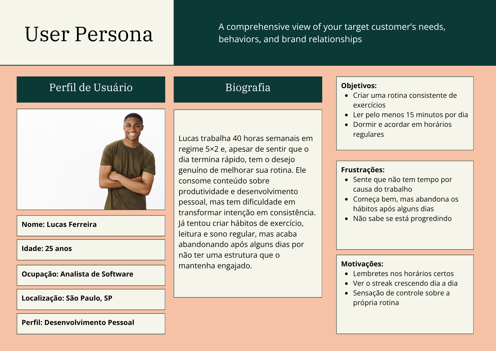
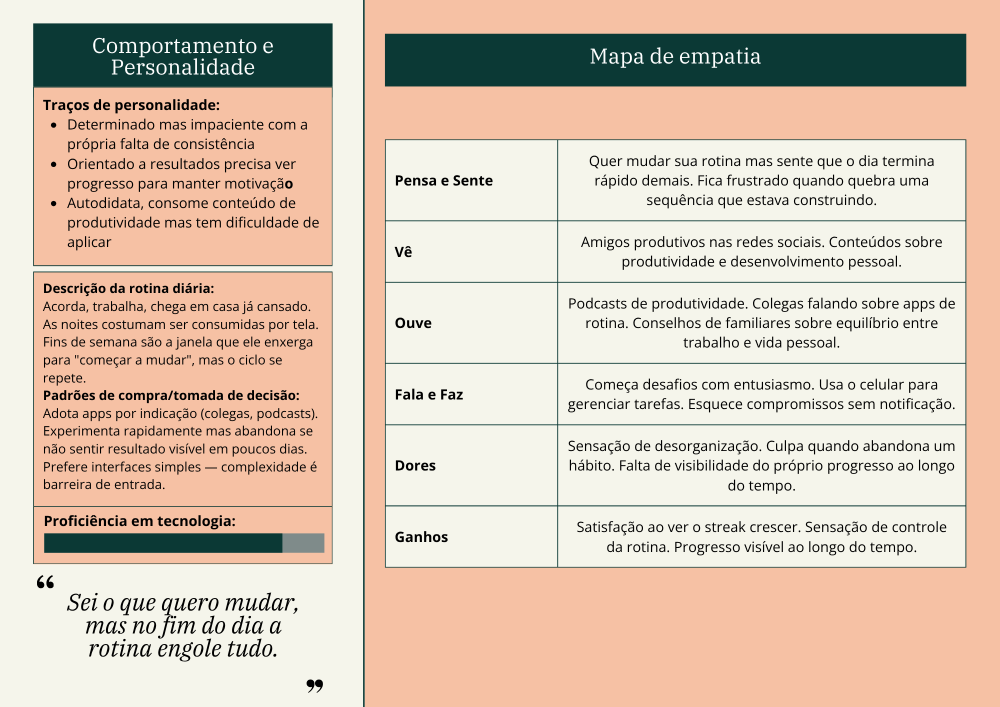

# 4. PROJETO DO DESIGN DE INTERAÇÃO

## 4.1 Personas
Nesta seção você deve detalhar as personas do seu projeto. Deve-se documentar uma persona por integrante do projeto. Para mais informações sobre personas consulte: https://www.rdstation.com/blog/marketing/persona-o-que-e/. Sugere-se a utilização de um template do Canva: https://www.canva.com/pt_br/modelos/s/persona/

### Persona 1 — Lucas Ferreira

**Nome:** Lucas Ferreira  
**Idade:** 25 anos  
**Ocupação:** Analista  
**Localização:** São Paulo, SP  
**Perfil:** Desenvolvimento Pessoal  

Lucas trabalha 40 horas semanais em regime 5×2 e, apesar de sentir que o dia termina rápido, tem o desejo genuíno de melhorar sua rotina. Ele consome conteúdo sobre produtividade e desenvolvimento pessoal, mas tem dificuldade em transformar intenção em consistência. Já tentou criar hábitos de exercício, leitura e sono regular, mas acaba abandonando após alguns dias por não ter uma estrutura que o mantenha engajado.

| Campo | Detalhe |
|---|---|
| Idade | 25 anos |
| Ocupação | Analista (5×2, 40h/semana) |
| Hábitos que quer criar | Exercício físico, leitura diária (15 min), sono regular |
| Tecnologia | Usa smartphone para tudo; confortável com apps |

**Objetivos**
- Criar uma rotina consistente de exercícios
- Ler pelo menos 15 minutos por dia
- Dormir e acordar em horários regulares

**Frustrações**
- Sente que não tem tempo por causa do trabalho
- Começa bem, mas abandona os hábitos após alguns dias
- Não sabe se está progredindo

**Motivações**
- Lembretes nos horários certos
- Ver o streak crescendo dia a dia
- Sensação de controle sobre a própria rotina

### Persona 2 — Ricardo Oliveira

**Nome:** Ricardo Oliveira  
**Idade:** 42 anos  
**Ocupação:** Gerente de Logística  
**Localização:** Itajubá, MG  
**Perfil:** Bem-estar e Rotina  

Ricardo tem uma vida profissional estável, mas sente que o sedentarismo e a rotina automática o deixaram sem disposição. Ele quer retomar hábitos simples que tinha antes de os filhos nascerem, mas sente que precisa de um "empurrão" visual para não esquecer de cuidar de si mesmo entre uma reunião e outra.

| Campo | Detalhe |
|---|---|
| Idade | 42 anos |
| Ocupação | Gerente de Logística (5×2, 40h/semana) |
| Hábitos que quer criar | Ir à academia (3x na semana), ler 10 páginas de um livro, meditar |
| Tecnologia | Usa muito o celular para trabalho; quer notificações de lembrete |

**Objetivos**
- Ir à academia regularmente para perder peso.
- Ler um livro de ficção antes de dormir.
- Fazer 5 minutos de meditação para reduzir o estresse.

**Frustrações**
- Chega em casa cansado e senta no sofá para ver TV.
- Sente dores nas costas por ficar muito tempo sentado.
- Começa a ler e dorme na segunda página por falta de hábito.

**Motivações**
- Ter mais fôlego para brincar com os filhos no final de semana.
- Reduzir a medicação para ansiedade com hábitos naturais.
- Completar a leitura de um livro que ganhou há meses.

### Persona 3 — Ana Souza

**Nome:** Ana Souza  
**Idade:** 17 anos  
**Ocupação:** Estudante (Vestibulanda)  
**Localização:** Belo Horizonte, MG  
**Perfil:** Preparação Acadêmica 

Ana está no último ano do ensino médio e se prepara para o vestibular e o ENEM. Sua rotina é intensa, conciliando escola, estudos em casa e, às vezes, cursinho. Apesar de estar motivada a alcançar uma boa nota, ela enfrenta dificuldades para manter consistência nos estudos e organizar seu tempo de forma eficiente. Frequentemente começa cronogramas de estudo bem estruturados, mas não consegue mantê-los por muito tempo, o que gera ansiedade e sensação de atraso.

| Campo | Detalhe |
|---|---|
| Idade | 17 anos |
| Ocupação | Estudante (Vestibulanda) |
| Hábitos que quer criar | Estudo diário consistente, revisão semanal, resolução de exercícios |
| Tecnologia | Usa smartphone e notebook; utiliza apps de estudo, cronômetros e plataformas online |

**Objetivos**
- Criar uma rotina consistente de estudos
- Revisar conteúdos com frequência para fixação
- Melhorar desempenho em simulados e provas

**Frustrações**
- Sente que não consegue cumprir o cronograma de estudos
- Fica ansiosa ao perceber que está atrasada em relação ao planejamento
- Não consegue visualizar claramente sue evolução

**Motivações**
- Lembretes para manter o ritmo de estudos
- Acompanhar progresso (horas estudadas, conteúdos concluídos)
- Sensação de estar avançando rumo à aprovação

## 4.2 Mapa de Empatia
Mapa da Empatia é um material utilizado para conhecer melhor o seu cliente. A partir do mapa da empatia é possível detalhar a personalidade do cliente e compreendê-la melhor. O objetivo é obter um nível mais profundo de compreensão de uma persona. A seguir um exemplo de template que pode ser usado para o mapa de empatia. Para cada persona deverá ser apresentado o seu respectivo mapa de empatia. Sugere-se a utilização do template apresentado em https://www.rdstation.com/blog/marketing/mapa-da-empatia/.

### Mapa de Empatia — Lucas Ferreira

| Dimensão | Conteúdo |
|---|---|
| **Pensa e Sente** | Quer mudar sua rotina mas sente que o dia termina rápido demais. Fica frustrado quando quebra uma sequência que estava construindo. |
| **Vê** | Amigos produtivos nas redes sociais. Conteúdos sobre produtividade e desenvolvimento pessoal. |
| **Ouve** | Podcasts de produtividade. Colegas falando sobre apps de rotina. Conselhos de familiares sobre equilíbrio entre trabalho e vida pessoal. |
| **Fala e Faz** | Começa desafios com entusiasmo. Usa o celular para gerenciar tarefas. Esquece compromissos sem notificação. |
| **Dores** | Sensação de desorganização. Culpa quando abandona um hábito. Falta de visibilidade do próprio progresso ao longo do tempo. |
| **Ganhos** | Satisfação ao ver o streak crescer. Sensação de controle da rotina. Progresso visível ao longo do tempo. |

### Mapa de Empatia — Ricardo Oliveira

| Dimensão | Conteúdo |
|---|---|
| **Pensa e Sente** | Quer recuperar a disposição física, mas sente que o "modo automático" do trabalho consome toda sua energia. Sente saudade da vitalidade que tinha antes da paternidade. |
| **Vê** | Reuniões constantes e planilhas de logística. No tempo livre, vê os filhos cheios de energia enquanto ele se sente exausto no sofá. |
| **Ouve** | Notificações de trabalho o dia todo. A esposa comentando sobre a saúde dele. Conselhos médicos sobre a necessidade de movimentar o corpo e reduzir o estresse. |
| **Fala e Faz** | Diz que "segunda-feira começa a academia", mas acaba priorizando o descanso passivo (TV). Usa o celular intensamente para gerenciar a frota, mas esquece de usá-lo para si mesmo. |
| **Dores** | Dores nas costas por sedentarismo. Culpa por não conseguir brincar com os filhos como gostaria. Frustração por não conseguir terminar uma leitura simples sem dormir. |
| **Ganhos** | Sensação de realização ao fechar o dia com os "checks" de autocuidado. Menos dependência de medicação. Prazer em compartilhar momentos ativos com a família. |

## 4.3 Protótipos das Interfaces
Apresente nesta seção os protótipos de alta fidelidade do sistema proposto. A fidelidade do protótipo refere-se ao nível de detalhes e funcionalidades incorporadas a ele. Assim, um protótipo de alta fidelidade é uma representação interativa do produto, baseada no computador ou em dispositivos móveis. Esse protótipo já apresenta maior semelhança com o design final em termos de detalhes e funcionalidades. No desenvolvimento dos protótipos, devem ser considerados os princípios gestálticos, as recomendações ergonômicas e as regras de design (como as 8 regras de ouro). É importante descrever no texto do relatório como os princípios gestálticos e as regras de ouro foram seguidas no projeto das interfaces. Nesta etapa deve-se dar uma ênfase na implementação do software de modo que possam ser realizados os testes com usuários na etapa seguinte.

## 4.4 Testes com Protótipos
Nesta seção você deve apresentar os testes realizados com usuários utilizando os protótipos de alta fidelidade desenvolvidos na seção anterior. O objetivo é avaliar a usabilidade, a clareza das informações e a adequação do design às necessidades das personas definidas no projeto.

Cada integrante do grupo deverá aplicar o teste com um usuário distinto, preferencialmente alinhado ao perfil das personas criadas. Devem ser definidas previamente as tarefas que o usuário deverá executar no protótipo (por exemplo: realizar um cadastro, buscar um produto, concluir uma compra).

Durante a aplicação do teste, registre observações sobre comportamentos, dúvidas, erros e comentários feitos pelo usuário, bem como o tempo necessário para a execução de cada tarefa. Ao final, colete o feedback do participante, destacando pontos positivos e aspectos a serem melhorados.

Os resultados obtidos por todos os integrantes devem ser consolidados, apresentando uma análise geral com os principais problemas encontrados, oportunidades de melhoria e as ações previstas para o projeto final. 
