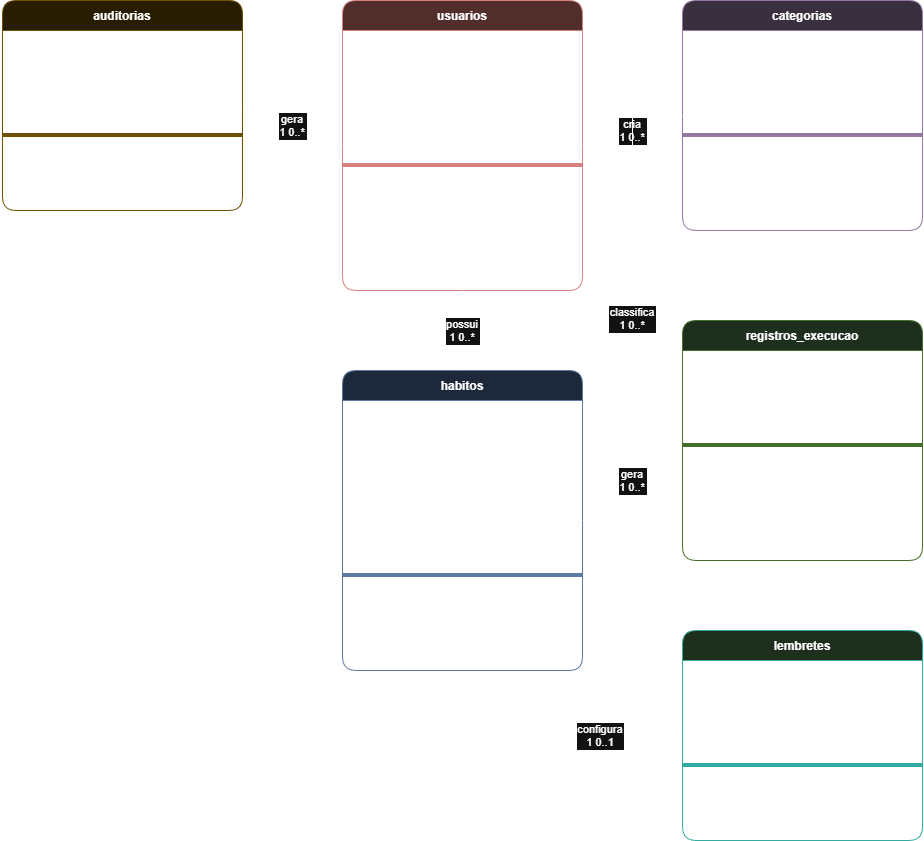

# 3. DOCUMENTO DE ESPECIFICAÇÃO DE REQUISITOS DE SOFTWARE

Este documento detalha a especificação de requisitos do sistema proposto, o SAH (Sistema de Acompanhamento de Hábitos), contemplando objetivos, escopo, requisitos funcionais e não funcionais, modelagem de casos de uso e diagrama de classes.

## 3.1 Objetivos deste documento

Descrever e especificar as necessidades dos usuários finais que devem ser atendidas pelo projeto SAH – Sistema de Acompanhamento de Hábitos, de modo a orientar as etapas de design, desenvolvimento e testes da aplicação.

## 3.2 Escopo do produto

### 3.2.1 Nome do produto e seus componentes principais
O produto será denominado **SAH – Sistema de Acompanhamento de Hábitos**. Ele será composto pelos seguintes módulos:

- **Módulo de Autenticação:** responsável pelo cadastro, login e recuperação de senha dos usuários.
- **Módulo de Gestão de Hábitos:** responsável pela criação, edição, exclusão e categorização dos hábitos monitorados.
- **Módulo de Check-in Diário:** responsável pelo registro diário de execução dos hábitos e pelo cálculo de sequências (streaks).
- **Módulo de Dashboard e Relatórios:** responsável pela exibição de métricas de progresso, gráficos de frequência e histórico de atividades.
- **Módulo de Notificações:** responsável pelo agendamento e disparo de lembretes configuráveis pelo usuário.

### 3.2.2 Missão do produto

Permitir que usuários registrem, monitorem e acompanhem hábitos pessoais ao longo do tempo, oferecendo feedback visual sobre o progresso e mecanismos de engajamento como sequências de dias consecutivos (streaks) e lembretes configuráveis.

### 3.2.3 Limites do produto
O SAH não fornece nenhuma forma de diagnóstico médico, prescrição de dietas, planos de treino físico ou orientação psicológica. O sistema não realiza integração com dispositivos wearables (smartwatches, pulseiras fitness) nem com aplicativos de saúde de terceiros. O SAH não contempla funcionalidades de rede social, compartilhamento público de progresso ou gamificação com competição entre usuários.

### 3.2.4 Benefícios do produto

| # | Benefício | Valor para o Cliente |
|----|-----------|----------------------|
| 1 | Registro diário rápido de hábitos | Essencial |
| 2 | Visualização de streaks e progresso | Essencial |
| 3 | Lembretes configuráveis pelo usuário | Essencial |
| 4 | Organização de hábitos por categorias | Recomendável |
| 5 | Histórico de registros por período | Recomendável |

## 3.3 Descrição geral do produto

### 3.3.1 Requisitos Funcionais

| Código | Requisito Funcional (Funcionalidade) | Descrição |
|--------|--------------------------------------|-----------|
| RF01 | Cadastrar usuário | O sistema deve permitir que o usuário crie uma conta com e-mail e senha |
| RF02 | Autenticar usuário | O sistema deve permitir login e logout com as credenciais cadastradas |
| RF03 | Gerenciar hábitos | O sistema deve permitir criar, editar, excluir e consultar hábitos |
| RF04 | Registrar conclusão diária | O sistema deve permitir marcar um hábito como concluído no dia atual |
| RF05 | Visualizar streaks | O sistema deve exibir a sequência de dias consecutivos em que o hábito foi concluído |
| RF06 | Configurar lembretes | O sistema deve permitir definir notificações para horários específicos por hábito |
| RF07 | Gerenciar categorias | O sistema deve permitir criar, editar, excluir e associar categorias aos hábitos |
| RF08 | Visualizar histórico | O sistema deve exibir o histórico de registros de um hábito por período |
| RF09 | Visualizar progresso geral | O sistema deve exibir um painel com resumo de todos os hábitos do dia (quantos concluídos e pendentes) |
| RF10 | Editar perfil | O sistema deve permitir ao usuário alterar nome e senha da conta |
| RF11 | Recuperar senha | O sistema deve permitir redefinição de senha via e-mail |
| RF12 | Arquivar hábito | O sistema deve permitir arquivar hábitos inativos sem excluí-los, preservando o histórico |
| RF13 | Gerenciar usuários (Admin) | O sistema deve permitir ao administrador visualizar a lista de usuários cadastrados, bloquear e desbloquear contas |
| RF14 | Visualizar métricas da plataforma (Admin) | O sistema deve permitir ao administrador visualizar estatísticas gerais da plataforma (total de usuários, total de hábitos cadastrados, taxa média de conclusão) |
| RF15 | Gerenciar categorias globais (Admin) | O sistema deve permitir ao administrador criar, editar e excluir categorias globais pré-definidas disponíveis para todos os usuários |
| RF16 | Visualizar logs do sistema (Admin) | O sistema deve permitir ao administrador consultar registros de atividade do sistema (logs de erros, acessos e operações críticas) |

### 3.3.2 Requisitos Não Funcionais

| Código | Requisito Não Funcional (Restrição) |
|--------|--------------------------------------|
| RNF01 | O sistema deve ser uma aplicação web responsiva, acessível via navegador |
| RNF02 | O sistema deve responder a interações do usuário em até 2 segundos |
| RNF03 | O sistema deve armazenar senhas de forma criptografada |
| RNF04 | O sistema deve funcionar de forma responsiva em dispositivos móveis e desktop |
| RNF05 | O sistema deve ser compatível com os navegadores Chrome, Firefox e Edge em suas versões mais recentes |
| RNF06 | O sistema deve sincronizar os dados com o servidor sempre que houver conexão ativa |
| RNF07 | A interface deve seguir diretrizes básicas de acessibilidade (contraste mínimo e tamanho de fonte legível) |
| RNF08 | O sistema deve estar em conformidade com a LGPD, permitindo ao usuário excluir sua conta e todos os seus dados |
| RNF09 | O sistema deve exibir mensagens de erro claras ao usuário em caso de falha de operação |
| RNF10 | O sistema deve realizar backup dos dados automaticamente |
| RNF11 | O código-fonte deve ser mantido em repositório versionado com controle de acesso |
| RNF12 | O sistema deve permitir o uso por múltiplos usuários cadastrados de forma independente e segura |

### 3.3.3 Usuários

| Ator | Descrição |
|------|-----------|
| Usuário | Pessoa cadastrada no sistema responsável pelo gerenciamento de seus próprios hábitos. Possui acesso total às funcionalidades do sistema referentes à sua conta. |
| Administrador | Responsável técnico pela manutenção da plataforma, gerenciamento de usuários, monitoramento de métricas globais e gestão de categorias pré-definidas. Possui acesso ao painel administrativo, mas não acessa dados pessoais de hábitos ou check-ins dos usuários. |

## 3.4 Modelagem do Sistema

### 3.4.1 Diagrama de Casos de Uso

### 3.4.2 Descrições de Casos de Uso

#### Cadastrar usuário (CSU01)

Sumário: O usuário efetua seu cadastro no sistema. 

Ator Primário: Usuário. 
Ator Secundário: Administrador.

Pré-condições: 
- O usuário deve ter acesso à página de cadastro.

Fluxo Principal: 

1. O usuário entra na página de cadastro. 
2. O sistema exibe um formulário com os dados a serem preenchidos (nome de usuário, e-mail e senha).
3. O usuário preenche os dados. 
4. O usuário envia o formulário. 
5. O sistema opera o armazenamento dos dados solicitados.
6. O novo usuário é adicionado na lista de usuários que o administrador tem acesso, e o administrador é notificado imediatamente.  

Fluxo Alternativo (1): Dados inválidos 

a) Se o campo solicitado estiver vazio ou preenchido com dados inválidos (e-mail com formatação errada, etc), o sistema reporta. 
b) O sistema segue com a página de cadastro aberta para que o usuário preencha de forma correta. 

Pós-condições: 
- O usuário é cadastrado com sucesso no sistema. 
- O administrador passa a ter acesso ao novo usuário cadastrado.

#### Autenticar usuário (CSU02)

Sumário: O usuário realiza seu login com as credenciais cadastradas. 

Ator Primário: Usuário

Pré-condições: 
- O usuário deve estar previamente cadastrado no sistema.

Fluxo Principal: 

1. O usuário acessa a tela de login.
2. O sistema exibe os campos de usuário (login) e senha. 
3. O usuário insere suas credenciais. 
4. O usuário clica no botão "Entrar". 
5. O sistema valida as credenciais.
6. O sistema cria uma sessão ativa e redireciona para a página principal.

Fluxo Alternativo (1): Credenciais Inválidas

a) Se o campo solicitado estiver vazio ou conter um e-mail não cadastrado/inválido, o sistema identifica e reporta.  
b) O sistema permite uma nova tentativa de autenticação.  
c) O fluxo volta ao passo 2.  

Pós-condições: 
- O usuário é autenticado com sucesso.

#### Gerenciar hábitos (CSU03)

Sumário: O usuário realiza a gestão (inclusão, edição, exclusão e consulta) dos dados referentes aos hábitos que o mesmo quer adquirir. 

Ator Primário: Usuário.

Pré-condições: 
- O usuário deve estar autenticado no sistema.
  
Fluxo Principal: 

1. O usuário entra no sistema a fim de gerenciar seus hábitos. 
2. O sistema apresenta a aba desejada com as operações que podem ser realizadas: inclusão de um novo hábito, alteração de um hábito, exclusão de um hábito e a consulta dos hábitos já existentes do usuário. 
3. O usuário seleciona a operação desejada: inclusão, exclusão, alteração ou consulta, ou escolhe finalizar o caso de uso. 
4. Se o usuário desejar continuar com o gerenciamento de hábitos, o caso de uso retorna ao passo 2; de outra forma o caso de uso termina. 

Fluxo Alternativo (1): Inclusão

a) O usuário solicita a inclusão de um novo hábito.  
b) O sistema apresenta uma janela solicitando o nome do hábito que vai ser registrado.  
c) O usuário fornece os dados requeridos. 
d) O sistema registra o hábito.  

Fluxo Alternativo (2): Exclusão

a) O usuário seleciona um hábito e requisita que o sistema remova.  
b) O sistema realiza a exclusão.  

Fluxo Alternativo (3): Alteração

a) O usuário altera um ou mais dos detalhes de determinado hábito e requisita sua atualização.  
b) O sistema altera os dados na lista de hábitos.  

Fluxo Alternativo (4): Consulta

a) O usuário decide pesquisar pelo nome do hábito e solicita a consulta sobre a lista de hábitos.  
b) O sistema apresenta uma lista de hábitos.  
c) O usuário seleciona o hábito. 
d) O sistema apresenta os detalhes do hábito.  

Pós-condições: 
- Os hábitos do usuário podem ser criados, atualizados ou removidos.
- As alterações são persistidas no sistema. 

#### Registrar conclusão diária (CSU04)

Sumário: O usuário marca um hábito como concluído no dia atual. 

Ator Primário: Usuário. 

Pré-condições: 
- O usuário deve estar autenticado.

Fluxo Principal: 

1. O usuário acessa a lista de hábitos cadastrados. 
2. O usuário escolhe o hábito que deseja marcar como concluído. 
3. O sistema apresenta uma caixa de seleção para realizar a operação de marcar como concluído. 
4. O usuário realiza essa operação. 
5. O sistema atualiza a lista de hábitos. 

Pós-condições: 
- O registro de conclusão do hábito é armazenado para o dia atual.
- A lista de hábitos é atualizada. 

#### Visualizar streaks (CSU05)

Sumário: O usuário visualiza a sequência de dias consecutivos em que concluiu determinado hábito. 

Ator Primário: Usuário. 

Pré-condições: 
- O usuário deve estar autenticado.

Fluxo Principal: 

1. O usuário acessa a lista de hábitos cadastrados. 
2. O usuário escolhe o hábito que deseja ver a sequência de dias concluídos. 
3. O sistema calcula e apresenta automaticamente a sequência de dias consecutivos que determinado hábito foi marcado como concluído. 

Pós-condições: 
- A sequência de dias consecutivos é exibida ao usuário.
- Nenhum dado é alterado no sistema.

#### Configurar lembretes (CSU06)

Sumário: O usuário define lembretes relacionados aos hábitos cadastrados. 

Ator Primário: Usuário

Pré-condições: 
- O usuário deve estar autenticado.

Fluxo Principal: 

1. O usuário acessa a lista de hábitos cadastrados. 
2. O usuário escolhe o hábito que deseja configurar um lembrete. 
3. O sistema fornece a opção de “configurar lembrete”. 
4. O usuário preenche os dados solicitados em um formulário com o horário que deseja ser lembrado. 
5. O sistema registra.

Fluxo Alternativo (1): Dados inválidos 

a) Se o campo solicitado estiver vazio ou preenchido com dados inválidos, o sistema reporta. 

Pós-condições: 
- O lembrete é registrado no sistema.
- O hábito passa a ter um lembrete associado.

#### Gerenciar Categorias (CSU07)

Sumário: O usuário realiza a gestão (criação, edição, exclusão e associação) das categorias para a organização dos seus hábitos. 

Ator Primário: Usuário. 

Pré-condições:
- O usuário deve estar autenticado.

Fluxo Principal: 

1. O usuário entra no sistema a fim de gerenciar as categorias dos seus hábitos. 
2. O sistema apresenta a aba desejada com as operações que podem ser realizadas: criação de uma nova categoria, edição de uma categoria, exclusão de uma categoria e a associação de categorias já existentes. 
3. O usuário seleciona a operação desejada: criação, edição, exclusão ou associação, ou escolhe finalizar o caso de uso. Se o usuário desejar continuar com o gerenciamento de categorias, o caso de uso retorna ao passo 2; de outra forma o caso de uso termina. 

Fluxo Alternativo (1): Criação 

a) O usuário solicita a criação de uma nova categoria.  
b) O sistema apresenta uma janela solicitando o nome da categoria que vai ser registrada.  
c) O usuário fornece os dados requeridos.  
d) O sistema registra a categoria.  

Fluxo Alternativo (2): Edição 

a) O usuário solicita a edição de uma categoria existente.  
b) O usuário edita um ou mais detalhes de determinada categoria e requisita sua atualização.  
c) O sistema altera e atualiza os dados da categoria escolhida.  

Fluxo Alternativo (3): Exclusão 

a) O usuário requisita a exclusão de uma categoria já existente.  
b) O sistema realiza a exclusão.  

Fluxo Alternativo (4): Associação

a) O usuário decide associar um hábito a uma categoria já criada.  
b) O usuário seleciona o hábito escolhido.  
c) O sistema apresenta uma opção que permite associar uma categoria.  
d) O usuário escolhe a opção que deseja.  
e) O sistema atualiza o hábito, agora com uma categoria definida.  

Pós-condições: 
- As categorias podem ser criadas, editadas, excluídas ou associadas a hábitos.
- As alterações são persistidas no sistema.

#### Visualizar histórico (CSU08)

Sumário: O usuário visualiza o histórico de registros de um hábito ao longo de um período específico, para acompanhar seu progresso e consistência. 

Ator Primário: Usuário. 

Pré-condições:
- O usuário deve estar autenticado.

Fluxo Principal: 

1. O usuário acessa a lista de hábitos. 
2. O usuário seleciona um hábito. 
3. O usuário escolhe um período para visualização (ex: últimos 7 dias)
4. O sistema consulta os registros do hábito no período informado. 
5. O sistema apresenta os dados de forma organizada (lista ou calendário).

Pós-condições: 
- O histórico do hábito é exibido conforme o período selecionado.
- Nenhum dado é alterado no sistema.

#### Visualizar progresso geral (CSU09)

Sumário: O usuário visualiza um painel com o resumo dos hábitos do dia.

Ator Primário: Usuário.

Pré-condições:
- O usuário deve estar autenticado no sistema.

Fluxo Principal:

1. O usuário acessa o painel principal.
2. O sistema exibe o resumo dos hábitos do dia.
3. O sistema apresenta a quantidade de hábitos concluídos e pendentes.
4. O sistema exibe indicadores visuais (ex: barra de progresso ou porcentagem).

Fluxo Alternativo (1): Nenhum hábito cadastrado

a) O sistema identifica que o usuário não possui hábitos cadastrados. 
b) O sistema exibe uma mensagem orientando o usuário a criar seu primeiro hábito.

Pós-condições:
- O progresso diário dos hábitos foi apresentado ao usuário.
- Nenhum dado é alterado no sistema.

#### Editar perfil (CSU10)

Sumário: O usuário realiza a alteração de seus dados cadastrais.

Ator Primário: Usuário.

Pré-condições:
- O usuário deve estar autenticado.

Fluxo Principal:

1. O usuário acessa a opção de edição de perfil.
2. O sistema apresenta um formulário com os dados atuais do usuário (nome e campos de alteração de senha).
3. O usuário altera nome e/ou senha.
4. O usuário solicita a atualização dos dados.
5. O sistema valida as informações.
6. O sistema salva as alterações, encerra a sessão ativa e confirma a operação.

Fluxo Alternativo (1): Dados inválidos

a) O sistema identifica campos inválidos (nome vazio, senha muito curta, etc.). 
b) O sistema informa o erro e solicita correção. 
c) O fluxo retorna ao passo 3.

Fluxo Alternativo (2): Senha atual incorreta

a) O sistema verifica que a senha atual informada não corresponde à senha cadastrada. 
b) O sistema informa o erro sem revelar a senha correta. 
c) O fluxo retorna ao passo 3.

Pós-condições:
- Os dados do usuário foram atualizados.
- O usuário recebe confirmação visual da operação.

#### Recuperar senha (CSU11)

Sumário: O usuário redefine sua senha por meio de e-mail.

Ator Primário: Usuário.
Ator Secundário: Serviço de E-mail.

Pré-condições:
- O usuário deve possuir e-mail cadastrado.
- O usuário não deve estar autenticado no sistema.

Fluxo Principal:

1. O usuário solicita recuperação de senha na tela de login.
2. O sistema solicita o e-mail cadastrado.
3. O usuário informa o e-mail.
4. O sistema envia um link de redefinição com validade limitada.
5. O usuário acessa o link recebido.
6. O sistema solicita a nova senha.
7. O usuário informa a nova senha.
8. O sistema valida e atualiza a senha.

Fluxo Alternativo (1): E-mail não encontrado

a) O sistema informa que o e-mail não está cadastrado. 
b) O fluxo retorna ao passo 2.

Fluxo Alternativo (2): Link de redefinição expirado

a) O usuário acessa um link de redefinição cujo prazo já expirou. 
b) O sistema informa que o link não é mais válido. 
c) O sistema oferece a opção de solicitar um novo link. 
d) O fluxo retorna ao passo 2.

Fluxo Alternativo (3): Nova senha inválida

a) O sistema identifica que a nova senha não atende aos critérios mínimos (ex: comprimento insuficiente). 
b) O sistema informa os requisitos e solicita nova entrada. 
c) O fluxo retorna ao passo 7.

Pós-condições:
- A senha do usuário foi redefinida.
- Links de redefinição anteriores são invalidados.

#### Arquivar hábito (CSU12)

Sumário: O usuário arquiva hábitos inativos sem excluí-los, preservando o histórico.

Ator Primário: Usuário.

Pré-condições:
- O usuário deve estar autenticado e possuir hábitos cadastrados.

Fluxo Principal:

1. O usuário acessa sua lista de hábitos.
2. O sistema apresenta os hábitos ativos.
3. O usuário seleciona um hábito.
4. O usuário solicita o arquivamento.
5. O sistema move o hábito para a lista de arquivados.

Fluxo Alternativo (1): Hábito já arquivado

a) O sistema identifica que o hábito selecionado já se encontra arquivado. 
b) O sistema informa o usuário e não realiza nenhuma alteração.

Pós-condições:
- O hábito foi arquivado e permanece disponível para consulta.
- O hábito não aparece na listagem principal de hábitos ativos.

#### Gerenciar usuários (CSU13)

Sumário: O administrador visualiza a lista de usuários cadastrados e gerencia o status de suas contas.

Ator Primário: Administrador.

Pré-condições:
- O administrador deve estar autenticado e possuir permissão de administrador.

Fluxo Principal:

1. O administrador acessa a área de gerenciamento de usuários.
2. O sistema apresenta a lista de usuários cadastrados com nome, e-mail e status da conta.
3. O administrador seleciona um usuário para visualizar seus detalhes.
4. O sistema exibe os dados do usuário selecionado.
5. O administrador seleciona a operação desejada: bloquear ou desbloquear a conta.
6. O sistema executa a ação e atualiza o status do usuário na lista.

Fluxo Alternativo (1): Bloquear conta

a) O administrador seleciona a opção de bloquear a conta de um usuário ativo. 
b) O sistema solicita confirmação da ação. 
c) O administrador confirma. 
d) O sistema bloqueia a conta e impede novos logins do usuário.

Fluxo Alternativo (2): Desbloquear conta

a) O administrador seleciona a opção de desbloquear a conta de um usuário bloqueado. 
b) O sistema reativa a conta e permite que o usuário faça login novamente.

Fluxo Alternativo (3): Nenhum usuário encontrado

a) A lista de usuários está vazia ou nenhum resultado corresponde ao filtro aplicado. 
b) O sistema exibe uma mensagem informando a ausência de resultados.

Pós-condições:
- O status da conta do usuário selecionado foi atualizado.
- O usuário bloqueado perde imediatamente o acesso ao sistema.

#### Visualizar métricas da plataforma (CSU14)

Sumário: O administrador visualiza estatísticas gerais da plataforma.

Ator Primário: Administrador.

Pré-condições:
- O administrador deve estar autenticado e possuir permissão de administrador.

Fluxo Principal:

1. O administrador acessa o painel de métricas.
2. O sistema consulta os dados agregados da plataforma.
3. O sistema exibe total de usuários cadastrados, total de hábitos cadastrados e taxa média de conclusão.

Fluxo Alternativo (1): Dados insuficientes para geração de métricas

a) O sistema identifica que não há dados suficientes para calcular uma ou mais métricas (ex: nenhum usuário ativo). 
b) O sistema exibe as métricas disponíveis e indica com "—" as que não podem ser calculadas.

Pós-condições:
- As métricas foram exibidas ao administrador.
- Nenhum dado é alterado no sistema.

#### Gerenciar categorias globais (CSU15)

Sumário: O administrador realiza a gestão das categorias globais pré-definidas disponíveis para todos os usuários.

Ator Primário: Administrador.

Pré-condições:
- O administrador deve estar autenticado e possuir permissão de administrador.

Fluxo Principal:

1. O administrador acessa a área de categorias globais.
2. O sistema apresenta as categorias globais existentes.
3. O administrador seleciona a operação desejada: criar, editar ou excluir uma categoria.
4. O sistema solicita os dados necessários conforme a operação.
5. O administrador informa os dados.
6. O sistema valida e salva as alterações.

Fluxo Alternativo (1): Criar categoria

a) O administrador solicita a criação de uma nova categoria global. 
b) O sistema apresenta um formulário solicitando nome e cor de identificação. 
c) O administrador preenche os dados e confirma. 
d) O sistema registra a categoria e a disponibiliza para todos os usuários.

Fluxo Alternativo (2): Editar categoria

a) O administrador seleciona uma categoria existente para edição. 
b) O sistema apresenta os dados atuais da categoria. 
c) O administrador altera os dados e confirma. 
d) O sistema atualiza a categoria.

Fluxo Alternativo (3): Excluir categoria em uso

a) O administrador solicita a exclusão de uma categoria que possui hábitos de usuários associados. 
b) O sistema informa que a categoria está em uso e exibe o número de hábitos vinculados. 
c) O sistema solicita confirmação, informando que os hábitos perderão a associação com essa categoria. 
d) O administrador confirma. 
e) O sistema remove a categoria e desassocia os hábitos vinculados.

Fluxo Alternativo (4): Dados inválidos

a) O sistema identifica que os dados fornecidos são inválidos (ex: nome vazio ou duplicado). 
b) O sistema informa o erro e solicita correção. 
c) O fluxo retorna ao passo 5.

Pós-condições:
- As categorias globais foram atualizadas no sistema.
- As alterações são refletidas imediatamente para todos os usuários.

#### Visualizar logs do sistema (CSU16)

Sumário: O administrador consulta os registros de atividade do sistema.

Ator Primário: Administrador.

Pré-condições:
- O administrador deve estar autenticado e possuir permissão de administrador.

Fluxo Principal:

1. O administrador acessa a área de logs do sistema.
2. O sistema exibe os registros mais recentes em ordem cronológica decrescente, sem filtros aplicados.
3. O administrador aplica filtros opcionais (data, tipo de evento, usuário).
4. O sistema atualiza a listagem exibindo apenas os registros que correspondem aos critérios informados.

Fluxo Alternativo (1): Nenhum resultado encontrado

a) Nenhum registro corresponde aos filtros aplicados. 
b) O sistema informa a ausência de resultados e permite que o administrador ajuste ou limpe os filtros.

Pós-condições:
- Os logs foram apresentados para consulta.
- Nenhum dado é alterado no sistema.

### 3.4.3 Diagrama de Classes

O diagrama abaixo apresenta as entidades centrais do sistema e seus relacionamentos. O Usuário é a entidade raiz e possui Hábitos. Cada Hábito pertence a uma Categoria e gera múltiplos Registros de Execução (check-ins). Lembretes são configurados individualmente por hábito. A distinção entre usuário comum e administrador é feita pelo campo is_admin na própria tabela de usuários.

### 3.4.4 Descrições das Classes

| # | Nome | Descrição |
|---|------|-----------|
| 1 | usuarios | Entidade central do sistema. Armazena nome, e-mail, senha (hash), status da conta (ativo/bloqueado) e data de cadastro. O campo `is_admin: boolean` define se o usuário tem acesso ao painel administrativo. Quando verdadeiro, a conta pode gerenciar usuários, visualizar métricas globais e consultar os logs de auditoria. Não existe tabela separada de roles. |
| 2 | categorias | Entidade auxiliar para organização lógica dos hábitos. Armazena nome e cor de identificação visual. O campo `is_global` indica se a categoria foi criada pelo administrador e está disponível para todos os usuários (`true`), ou se é uma categoria pessoal do próprio usuário (`false`). |
| 3 | habitos | Entidade central do sistema. Representa uma atividade recorrente configurada pelo usuário. Armazena nome, descrição, a frequência de execução esperada (campo `frequencia` em JSON com os dias da semana), além dos flags `ativo` e `arquivado`. Hábitos arquivados preservam o histórico de check-ins sem aparecer na listagem principal. |
| 4 | registros_execucao | Entidade transacional. Cada registro representa um check-in realizado, com a data e hora exatas. É a fonte de dados para todos os cálculos de progresso: streak atual, maior streak histórico e taxa de conclusão semanal/mensal. |
| 5 | lembretes | Entidade de configuração de alertas, associada 1-para-1 a um hábito. Armazena o horário de disparo e os dias da semana em que o lembrete deve ser enviado (campo `dias_disparo` em JSON). O campo `ativo` permite suspender as notificações sem deletar a configuração. |
| 6 | auditorias | Entidade de log do sistema. Registra eventos relevantes (logins, bloqueios de conta, operações administrativas). Armazena o tipo do evento (`tipo_evento`), uma descrição legível (`evento`), a data e a referência ao usuário que originou a ação. Consultada exclusivamente por usuários com `is_admin = true`. |
